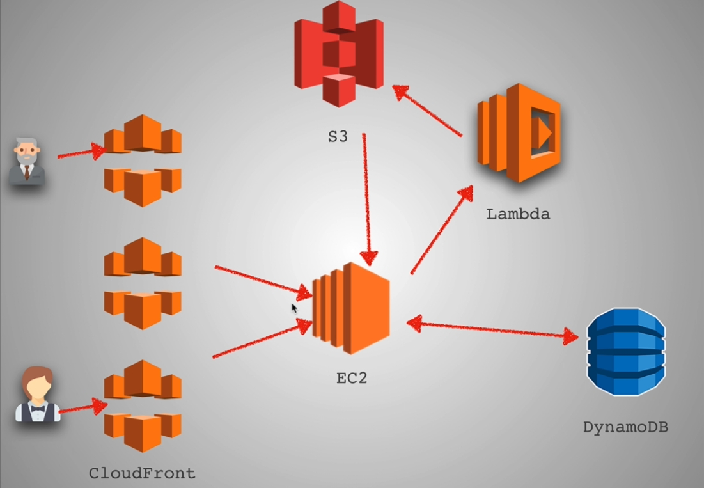
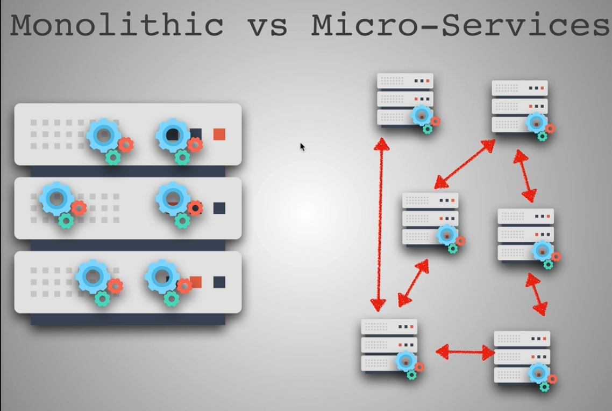

# AWS (Amazon Web Service)

- It's a leading IaaS (Infrastructure as a Service) & PaaS (Platform as a Service)

## Features

- **EC2:** is a bare metal machine to run and whatever compute you want. It is a virtual server like, Digital Ocean Linux server.
- **S3:** is an object storage service. Here, each object is store as a file with its metadata and id. It enables us to upload, store and download pretty much any file or object. It's size limit is 5GB.
- **Lambda:** with lambda you can run code for virtually any type of application or backend service.
- **CloudFront:** is a web service speeds up distribution of our static files like CDN. It delivers the static files, e.g. html, css, js etc., through a world wide network of data centers exactly like a CDN does.
- **DynamoDB:** is a fast NoSql database. It's a key-value and document database that delivers single-digit millisecond performance at any scale. It's a fully managed, multiregion, multimaster, durable database with built-in security, backup and restore, and in-memory caching for internet-scale applications.

## AWS Flowchart

- **Example:**
  

## Monolithic vs Micro-Services

